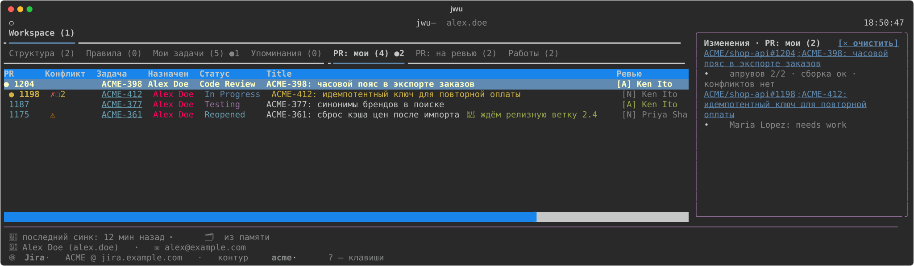
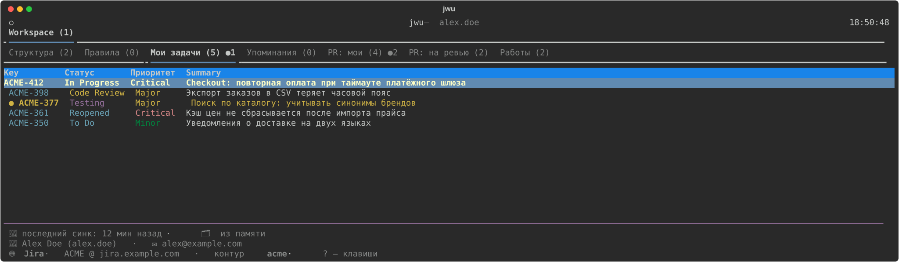

# jwu

Рабочий помощник разработчика для **Jira / Bitbucket / Jenkins** и **GitHub** — CLI, TUI-дашборд
и MCP-сервер со скиллами для **Claude Code** и **Cursor**. Держит в локальной памяти задачи,
PR, заметки и журнал работы, сам синкается в фоне и присылает в Telegram то, что требует
внимания. Агент берёт всё это одним вызовом и ничего не пишет наружу без твоего «да».



## Что умеет

**Задачи и PR**
- Мои задачи, упоминания, мои PR и PR на ревью — с конфликтами, сборками и задачами на комментах.
- Разбор красной сборки (Jenkins / GitHub Actions): наш баг или регресс из целевой ветки.
- Запись в Jira и PR только после подтверждения: комменты, статусы, ворклоги, создание PR,
  ответы ревьюерам, коммент точно на строку диффа. Правка и удаление — только своего.
- Трекинг времени цепочкой: «с 10:00 по МСК», ворклоги подряд без дыр.

**Фон и уведомления**
- Демон синкает все контуры по расписанию и сообщает в Telegram: конфликт, красная сборка,
  needs work, вернули с тестов, коммент QA, упоминания, «PR готов к мержу».
- Сообщения разбиты на «моё» и «участвую»; у смены статуса — кто перевёл и на ком задача.
- Бот двусторонний: `/sync`, `/status`, `/stuck`, ответ на уведомление — заметка.

**Память**
- Воркспейсы: рабочий и личный контуры не пересекаются, выбираются по папке.
- Работы (журнал цикла правок) с handoff для следующей сессии, заметки по задаче/PR/ветке,
  правила проекта, которые агент обязан соблюдать.
- Синк памяти между машинами через свой приватный git, бэкап и восстановление.

**Для агента (Claude Code, Cursor)**
- 30+ скиллов: план и итоги дня, старт и подхват работы, ревью своего кода, чужого PR и
  всей очереди ревью, разбор возврата с тестов, дежурство, 4test, коммит-месседж.
- Агент голоса: внешние тексты пишутся в твоём стиле по профилю, собранному из твоих же
  комментов и коммитов.
- Confluence: читать, создавать и править страницы (без удаления).
- SSH-стенды через ssh-mcp: смотреть логи стенда только на чтение.



## Установка

Нужны Python 3.10+ и [pipx](https://pipx.pypa.io).

```bash
pipx install git+<адрес этого репозитория>   # или из клона: pipx install .
jwu install                                  # скиллы + MCP для Claude Code (--for cursor | both)
jwu init ~/code/my-project --provider jira    # подключить проект (jira | github | local)
```

Дальше `jwu configure` — хосты и токены, `jwu doctor` — проверить, что всё на месте,
`jwu dashboard` — открыть дашборд. В сессии агента начни с `/jwu-session-init`.

## Документация

- [Установка и настройка](docs/setup.md) — Cursor, обновление, воркспейсы, доступы, бэкап
- [Синк, демон и Telegram](docs/notifications.md)
- [Задачи, PR и память](docs/tasks-and-prs.md) — запись наружу, трекинг времени
- [Скиллы, субагенты и MCP](docs/agents.md) — в том числе агент голоса
- [Confluence и SSH-стенды](docs/integrations.md)
- [Дашборд](docs/dashboard.md) · [Все команды](docs/commands.md)
