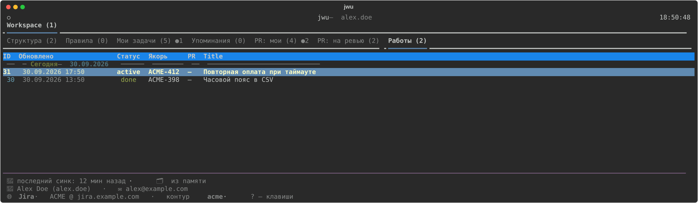

# Дашборд

`jwu dashboard [--sync] [-a]` — TUI со всем, что происходит в контуре.

Вкладки: Workspace · Структура · Правила · Мои задачи · Упоминания · PR: мои · PR: на ревью ·
Фичи · Работы. С `-a` локальные вкладки обновляются раз в 5 с, сетевые — раз в 15 мин,
открытая карточка — раз в минуту.

У PR в ячейке блокеров: `⚠` конфликт, `✗` красная сборка, `☐N` открытые задачи на комментах;
рядом с заголовком — закреплённая status-заметка. Точка `●` у вкладки и строки — есть
непросмотренные изменения; панель «Изменения» (`b`) показывает их списком.

| Клавиша | Действие |
|---|---|
| `?` | легенда клавиш текущей вкладки |
| `/` | поиск задачи |
| `b` | панель «Изменения» |
| `enter` | карточка задачи, PR или работы |
| `o` | открыть в браузере (или папку) |
| `y` / `Y` | скопировать ключ / меню копирования (ссылка, текст…) |
| `R` | синк всего |
| `W` | сменить воркспейс |
| `N` / `D` | создать / удалить — воркспейс, фичу, правило, работу (на их вкладках) |
| `q` | выход |
